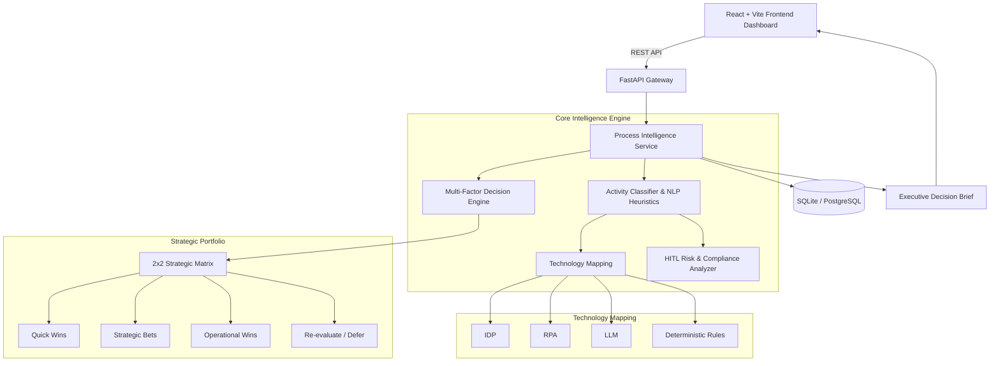

# ProcessIQ — Enterprise AI Case Intelligence Platform

> **Transform business processes into explainable AI and automation decisions.**

ProcessIQ is an enterprise-grade AI decision-support platform designed to analyze business workflows, identify automation and AI opportunities, evaluate implementation feasibility and risk, and prioritize initiatives using an explainable multi-factor scoring framework.

Instead of treating an entire business process as a single automation candidate, ProcessIQ decomposes workflows into individual activities and evaluates each activity for:

* AI suitability
* Automation feasibility
* Implementation effort
* Business impact
* Governance and risk
* Human-in-the-Loop (HITL) requirements
* Recommended technology approach

The resulting intelligence is presented through an enterprise dashboard, strategic prioritization matrix, explainable score breakdown, and executive decision brief.

---

## 🎯 Problem Statement

Organizations often have hundreds of business processes that could potentially benefit from AI or automation.

However, identifying the right opportunities is difficult because teams need to answer questions such as:

* Which processes should be automated first?
* Where can AI provide the most business value?
* Which activities require human intervention?
* Should an activity use an LLM, RPA, IDP, or deterministic rules?
* How much implementation effort will be required?
* What compliance or operational risks exist?
* Which initiatives are quick wins versus strategic investments?

ProcessIQ addresses these questions through a structured intelligence and prioritization pipeline.

---

# 🧠 How ProcessIQ Works

```text
Business Process
       │
       ▼
Activity Decomposition
       │
       ▼
Activity Classification
       │
       ├───────────────┐
       ▼               ▼
AI Suitability     Automation Feasibility
       │               │
       └───────┬───────┘
               ▼
       Technology Mapping
               │
       ├── IDP
       ├── RPA
       ├── LLM
       └── Deterministic Rules
               │
               ▼
        HITL / Risk Analysis
               │
               ▼
       Multi-Factor Scoring
               │
               ▼
       Priority Score
               │
               ▼
       Strategic 2×2 Matrix
               │
               ▼
      Executive Decision Brief
```

---

# ✨ Key Features

## 1. Activity-Level Process Analysis

ProcessIQ decomposes an end-to-end workflow into individual operational activities.

Example:

```text
Invoice Processing

1. Receive invoice
2. Extract invoice information
3. Validate invoice
4. Match invoice with purchase order
5. Send for approval
6. Process payment
```

Each activity can then be evaluated independently.

---

## 2. AI Opportunity Identification

The platform identifies activities that are strong candidates for AI or automation.

Examples include:

* Document extraction
* Data validation
* Classification
* Information retrieval
* Repetitive data entry
* Rule-based validation
* Decision support
* Text summarization
* Document matching

---

## 3. Technology Mapping

ProcessIQ recommends an appropriate technology pattern based on the characteristics of an activity.

| Technology            | Typical Use Case                                          |
| --------------------- | --------------------------------------------------------- |
| **IDP**               | Extracting information from invoices, forms and documents |
| **RPA**               | Repetitive UI-based tasks and system interactions         |
| **LLM**               | Unstructured text, summarization and reasoning assistance |
| **Rules Engine**      | Deterministic business validation                         |
| **Human-in-the-Loop** | High-risk or approval-based decisions                     |

The objective is not to force AI into every activity, but to identify the **most appropriate technology for each task**.

---

# 🛡️ Human-in-the-Loop Governance

Enterprise automation requires appropriate human oversight.

ProcessIQ identifies activities where human approval or review should remain mandatory.

Potential HITL triggers include:

* Financial approvals
* Regulatory decisions
* Compliance-sensitive activities
* High-value transactions
* Irreversible decisions
* Exceptions
* Low-confidence AI predictions

Example:

```text
Invoice Approval
       │
       ▼
AI validates invoice
       │
       ▼
Risk / confidence evaluation
       │
       ▼
Human approval required
       │
       ▼
Payment processing
```

This allows organizations to pursue automation without eliminating necessary governance controls.

---

# 📊 Explainable Scoring Framework

ProcessIQ evaluates processes using five normalized dimensions on a **1.0–5.0 scale**.

| Dimension                      | Description                                             |
| ------------------------------ | ------------------------------------------------------- |
| **I — Business Impact**        | Expected operational and business value                 |
| **S — AI Suitability**         | Suitability for AI-based capabilities                   |
| **F — Automation Feasibility** | Technical and operational feasibility                   |
| **E — Implementation Effort**  | Complexity, integrations and engineering effort         |
| **R — Governance & Risk**      | Compliance, regulatory and human oversight requirements |

---

## Priority Score

ProcessIQ uses the following explainable mathematical model:

```text
Priority Score =
min(
    98,
    max(
        25,
        ((I × S × F) / (E × R × κ)) × 100
    )
)
```

Where:

```text
κ = 8.5
```

The normalization constant provides a consistent scoring range across enterprise process evaluations.

The final score is constrained between:

```text
25 → 98
```

This prevents extreme mathematical outputs from producing misleading portfolio rankings.

---

# 🗺️ Strategic Portfolio Matrix

ProcessIQ maps analyzed processes into a 2×2 strategic portfolio.

```text
                    HIGH IMPACT
                         │
          STRATEGIC      │       QUICK
            BETS         │       WINS
                         │
       ──────────────────┼──────────────────
                         │
        RE-EVALUATE      │    OPERATIONAL
          / DEFER        │       WINS
                         │
                    LOW IMPACT
                         
             HIGH EFFORT       LOW EFFORT
```

### Quick Wins

High business impact with relatively low implementation effort.

Recommended for immediate execution.

### Strategic Bets

High-impact initiatives that require significant investment.

Recommended for strategic transformation programs.

### Operational Wins

Lower-impact opportunities that are relatively easy to implement.

Useful for incremental efficiency improvements.

### Re-evaluate / Defer

Low-impact opportunities with comparatively high effort or risk.

These should generally be postponed or reassessed.

---

# 🏗️ System Architecture



---

# 🛠️ Technology Stack

## Frontend

* React 18
* Vite
* JavaScript ES6+
* CSS3
* Enterprise Design System

## Backend

* Python 3.10+
* FastAPI
* Pydantic v2
* Uvicorn

## Data Layer

* SQLite for development
* SQLAlchemy ORM
* PostgreSQL-ready architecture

## Intelligence Layer

* Rule-based activity classification
* NLP heuristics
* Technology mapping
* HITL risk analysis
* Multi-factor scoring
* Strategic prioritization

---

# 📂 Project Structure

```text
enterprise-ai-case-intelligence/
│
├── backend/
│   ├── main.py
│   ├── scoring_engine.py
│   └── seed_data.py
│
├── frontend/
│   ├── src/
│   │   ├── components/
│   │   │   ├── PrioritizationMatrix.jsx
│   │   │   ├── ScoreBreakdown.jsx
│   │   │   └── ExecutiveExportButton.jsx
│   │   │
│   │   ├── App.jsx
│   │   ├── App.css
│   │   └── main.jsx
│   │
│   ├── package.json
│   └── vite.config.js
│
├── processiq.db
├── requirements.txt
└── README.md
```

---

# 🚀 Getting Started

## Prerequisites

Make sure the following are installed:

* Python 3.10+
* Node.js 18+
* npm
* Git

---

# 1. Clone the Repository

```bash
git clone <YOUR_GITHUB_REPOSITORY_URL>
cd enterprise-ai-case-intelligence
```

---

# 2. Backend Setup

Create and activate the virtual environment.

### Windows PowerShell

```powershell
python -m venv venv
.\venv\Scripts\activate
```

Install dependencies:

```powershell
pip install -r requirements.txt
```

---

# 3. Seed the Database

Run the seed script to populate ProcessIQ with sample enterprise workflows.

```powershell
python backend/seed_data.py
```

If your backend files are located directly in the project root, use:

```powershell
python seed_data.py
```

---

# 4. Start the Backend

```powershell
uvicorn backend.main:app --reload --port 8000
```

Or, if `main.py` is in the project root:

```powershell
uvicorn main:app --reload --port 8000
```

Backend:

```text
http://127.0.0.1:8000
```

Swagger API documentation:

```text
http://127.0.0.1:8000/docs
```

---

# 5. Frontend Setup

Open another terminal.

```powershell
cd frontend
npm install
```

Start the Vite development server:

```powershell
npm run dev
```

The dashboard will be available at:

```text
http://localhost:5173
```

---

# 🔌 API Endpoints

## Get All Processes

```http
GET /processes
```

Returns previously analyzed processes and their analysis metadata.

---

## Create a Process

```http
POST /processes
```

Example request:

```json
{
  "name": "Invoice Processing",
  "department": "Finance",
  "description": "Extract, validate, and match vendor invoices against purchase orders for payment.",
  "activities": [
    "Receive invoices from vendors",
    "Extract invoice details",
    "Validate invoice information",
    "Match invoice with purchase order",
    "Send invoice for approval",
    "Process payment"
  ]
}
```

---

## Analyze a Process

```http
POST /analyze/{process_id}
```

Returns the intelligence analysis for the selected process.

Example response structure:

```json
{
  "process_id": 1,
  "priority_score": 85,
  "ai_opportunity": "High",
  "automation_potential": "High",
  "human_involvement": "Low",
  "quadrant": "Quick Wins",
  "dimensions": {
    "impact": 4.5,
    "ai_suitability": 4.2,
    "feasibility": 4.4,
    "effort": 2.1,
    "risk": 1.8
  }
}
```

---

# 🧪 Example Use Case

Consider an invoice-processing workflow:

```text
Invoice Processing
        │
        ├── Receive invoice
        │
        ├── Extract invoice details
        │
        ├── Validate invoice
        │
        ├── Match against PO
        │
        ├── Approve invoice
        │
        └── Process payment
```

ProcessIQ may identify:

| Activity         | Technology          | HITL                         |
| ---------------- | ------------------- | ---------------------------- |
| Receive invoice  | RPA / Workflow      | No                           |
| Extract details  | IDP                 | No                           |
| Validate invoice | Rules + AI          | Exception-based              |
| Match PO         | Rules / AI          | Exception-based              |
| Approve invoice  | AI Decision Support | **Yes**                      |
| Process payment  | RPA / Workflow      | **Yes for high-value cases** |

This produces a more realistic automation strategy than simply labeling the entire process as "AI suitable."

---

# 📈 Enterprise Decision Flow

ProcessIQ is designed to support the complete journey from process discovery to investment prioritization.

```text
DISCOVER
   ↓
Document Business Process
   ↓
DECOMPOSE
   ↓
Break Into Activities
   ↓
ANALYZE
   ↓
Evaluate AI + Automation Suitability
   ↓
GOVERN
   ↓
Identify Risk + HITL Requirements
   ↓
SCORE
   ↓
Calculate Explainable Priority
   ↓
PRIORITIZE
   ↓
Map To Strategic Portfolio
   ↓
DECIDE
   ↓
Generate Executive Decision Brief
```

---

# 🔐 Enterprise Readiness

## Explainability

The scoring framework exposes the dimensions contributing to a process's priority score.

This helps decision-makers understand:

```text
Why was this process prioritized?
```

rather than simply receiving a black-box prediction.

---

## Auditability

ProcessIQ maintains structured analysis data so that process evaluations can be reviewed and re-evaluated.

---

## Human Oversight

High-risk activities can be explicitly marked for human review.

This supports responsible AI adoption in enterprise environments.

---

## Database Agnostic Design

SQLAlchemy provides an abstraction layer between the application and database.

Development:

```text
SQLite
```

Production:

```text
PostgreSQL
```

This allows the data layer to evolve without requiring major changes to the intelligence layer.

---

# 📊 Current Development Status

| Component                       | Status |
| ------------------------------- | ------ |
| Process creation                | ✅      |
| Process database                | ✅      |
| FastAPI backend                 | ✅      |
| Process analysis API            | ✅      |
| Activity classification         | ✅      |
| AI opportunity analysis         | ✅      |
| Automation feasibility          | ✅      |
| HITL analysis                   | ✅      |
| Multi-factor scoring            | ✅      |
| Process prioritization          | ✅      |
| React dashboard                 | ✅      |
| Process library                 | ✅      |
| Score breakdown                 | 🚧     |
| 2×2 prioritization matrix       | 🚧     |
| Executive PDF export            | 🚧     |
| PostgreSQL production migration | 🔜     |
| Advanced ML/NLP models          | 🔜     |

---

# 🔮 Future Enhancements

### AI-Powered Process Understanding

Integrate LLM-based reasoning to improve activity classification and recommendations.

### Process Mining

Support event-log data to discover real process execution patterns rather than relying only on manually entered workflows.

### Advanced Risk Intelligence

Introduce configurable enterprise policies for:

* Regulatory risk
* Financial thresholds
* Data sensitivity
* Model confidence
* Approval requirements

### PostgreSQL Deployment

Move production workloads from SQLite to PostgreSQL.

### Authentication & RBAC

Introduce enterprise roles such as:

```text
Administrator
Process Owner
Business Analyst
AI Architect
Executive
Auditor
```

### Executive Analytics

Add portfolio-level dashboards showing:

* Total automation opportunities
* Estimated business impact
* Implementation effort
* AI adoption readiness
* Risk distribution
* Quick-win pipeline
* Strategic investment pipeline

---

# 🎯 Project Objectives

ProcessIQ is designed to demonstrate how AI can be applied not merely to generate content or predictions, but to support **enterprise-level decision making**.

The project focuses on:

* Business process intelligence
* Explainable AI
* AI opportunity discovery
* Automation strategy
* Enterprise governance
* Human-in-the-loop systems
* Quantitative prioritization
* Strategic portfolio management

---

# 💡 Why ProcessIQ?

Traditional automation assessments often rely heavily on manual consulting analysis.

ProcessIQ introduces a structured intelligence layer that helps organizations move from:

```text
"What can we automate?"
```

to:

```text
"What should we automate first,
why should we automate it,
what technology should we use,
what risks exist,
and where should humans remain involved?"
```

That distinction makes ProcessIQ a **decision-support platform**, rather than simply an automation recommendation tool.

---

# 👩‍💻 Author

**Manaswini Sama**

B.Tech — Computer Science & Engineering
Specialization: Artificial Intelligence & Machine Learning

Interested in:

* Artificial Intelligence
* Machine Learning
* Enterprise AI
* Full-Stack Development
* Cloud Computing
* AI Product Engineering

---

# 📄 License

This project is developed for educational, research, portfolio, and enterprise AI case-study purposes.

---

## ⭐ ProcessIQ

**From Business Process → AI Intelligence → Strategic Decision**

> Analyze. Explain. Prioritize. Transform.
