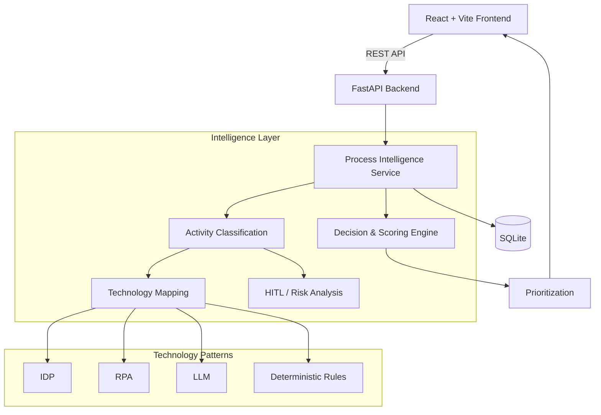

# ProcessIQ — Enterprise AI Case Intelligence Platform

> **Transform business processes into explainable AI and automation decisions.**

ProcessIQ is an enterprise AI decision-support platform designed to analyze business workflows, identify AI and automation opportunities, evaluate implementation feasibility and risk, and prioritize initiatives using an explainable multi-factor scoring framework.

Instead of evaluating an entire business process as a single automation candidate, ProcessIQ breaks the workflow into individual activities and evaluates each activity based on:

* Business impact
* AI suitability
* Automation feasibility
* Implementation effort
* Governance and risk
* Human-in-the-Loop (HITL) requirements
* Recommended technology approach

The resulting analysis is presented through a structured enterprise dashboard and prioritization framework to help teams answer:

> **What should we automate first, why, using which technology, and where should humans remain involved?**

---

## 🎯 Problem Statement

Organizations often have hundreds of business processes that could potentially benefit from AI or automation.

However, identifying the right opportunities is difficult because teams need to determine:

* Which processes should be automated first?
* Where can AI provide the greatest business value?
* Which activities require human intervention?
* Should an activity use an LLM, RPA, IDP, or deterministic rules?
* How much implementation effort will be required?
* What operational or governance risks exist?
* Which opportunities are quick wins versus strategic investments?

Traditional assessments often depend heavily on manual analysis and subjective prioritization.

**ProcessIQ provides a structured decision-support layer for this assessment.**

---

# 🧠 How ProcessIQ Works

```text
Business Process
       │
       ▼
Activity Decomposition
       │
       ▼
Activity Analysis
       │
       ├───────────────┐
       ▼               ▼
AI Suitability    Automation Feasibility
       │               │
       └───────┬───────┘
               ▼
       Technology Mapping
               │
       ├── IDP
       ├── RPA
       ├── LLM
       └── Deterministic Rules
               │
               ▼
       HITL / Risk Analysis
               │
               ▼
       Multi-Factor Scoring
               │
               ▼
         Priority Score
               │
               ▼
       Strategic Prioritization
               │
               ▼
       Decision Support
```

---

# ✨ Key Features

## 1. Activity-Level Process Analysis

ProcessIQ decomposes an end-to-end workflow into individual operational activities.

Example:

```text
Invoice Processing

1. Receive invoice
2. Extract invoice information
3. Validate invoice
4. Match invoice with purchase order
5. Send for approval
6. Process payment
```

Each activity can be evaluated independently.

This is important because different activities within the same process may require completely different automation strategies.

---

## 2. AI Opportunity Identification

ProcessIQ identifies activities that are suitable candidates for AI or automation.

Potential opportunities include:

* Document extraction
* Data validation
* Classification
* Information retrieval
* Repetitive data entry
* Rule-based validation
* Decision support
* Text summarization
* Document matching

The objective is **not to force AI into every activity**.

Instead, the platform evaluates where AI or automation is appropriate.

---

## 3. Technology Mapping

ProcessIQ maps activities to appropriate technology patterns.

| Technology              | Typical Use Case                                          |
| ----------------------- | --------------------------------------------------------- |
| **IDP**                 | Extracting information from invoices, forms and documents |
| **RPA**                 | Repetitive UI-based tasks and system interactions         |
| **LLM**                 | Unstructured text, summarization and reasoning assistance |
| **Deterministic Rules** | Predictable business validation and policy checks         |
| **Human-in-the-Loop**   | High-risk, approval-based or exception scenarios          |

The technology recommendation is intended to support **technology selection rather than technology replacement**.

---

# 🛡️ Human-in-the-Loop Governance

Enterprise automation requires appropriate human oversight.

ProcessIQ identifies scenarios where human review or approval should remain part of the workflow.

Potential HITL conditions include:

* Financial approvals
* Regulatory decisions
* Compliance-sensitive activities
* High-value transactions
* Irreversible decisions
* Exceptions
* Low-confidence AI predictions

Example:

```text
Invoice Approval
       │
       ▼
AI-assisted validation
       │
       ▼
Risk / confidence evaluation
       │
       ▼
Human approval
       │
       ▼
Payment processing
```

This supports a **human-supervised automation model** rather than unrestricted automation.

---

# 📊 Explainable Scoring Framework

ProcessIQ evaluates opportunities using five normalized dimensions on a **1.0–5.0 scale**.

| Dimension                      | Description                                         |
| ------------------------------ | --------------------------------------------------- |
| **I — Business Impact**        | Expected operational and business value             |
| **S — AI Suitability**         | Suitability for AI-based capabilities               |
| **F — Automation Feasibility** | Technical and operational feasibility               |
| **E — Implementation Effort**  | Engineering, integration and operational complexity |
| **R — Governance & Risk**      | Compliance, risk and human-oversight requirements   |

## Priority Score

The current decision engine uses the following explainable scoring model:

```text
Priority Score =
min(
    98,
    max(
        25,
        ((I × S × F) / (E × R × κ)) × 100
    )
)
```

Where:

```text
κ = 8.5
```

The result is bounded between:

```text
25 → 98
```

The scoring model is intentionally transparent so that users can understand the factors contributing to a recommendation rather than receiving an unexplained black-box score.

> **Important:** The current scoring engine is a deterministic decision framework. It is designed to provide explainable prioritization rather than claim predictive ML performance.

---

# 🗺️ Strategic Portfolio Prioritization

Analyzed opportunities can be positioned conceptually using a 2×2 portfolio framework based on business impact and implementation effort.

```text
                     HIGH IMPACT
                         │
       STRATEGIC         │          QUICK
          BETS           │          WINS
                         │
─────────────────────────┼────────────────────────
                         │
      RE-EVALUATE        │       OPERATIONAL
        / DEFER          │          WINS
                         │
                     LOW IMPACT

              HIGH EFFORT       LOW EFFORT
```

### Quick Wins

High-impact opportunities with relatively low implementation effort.

**Recommended action:** prioritize for near-term execution.

### Strategic Bets

High-impact initiatives requiring significant investment.

**Recommended action:** evaluate as strategic transformation initiatives.

### Operational Wins

Lower-impact opportunities that are relatively easy to implement.

**Recommended action:** use for incremental operational improvements.

### Re-evaluate / Defer

Lower-value opportunities with comparatively high effort or risk.

**Recommended action:** reassess before allocating significant resources.

---

# 🏗️ System Architecture



### Architecture Flow

```text
React Frontend
      ↓
FastAPI REST API
      ↓
Process Intelligence Layer
      ↓
Activity Analysis
      ↓
Technology + HITL Assessment
      ↓
Scoring Engine
      ↓
Prioritization
      ↓
Dashboard
```

The architecture separates the presentation layer, API layer, intelligence logic and persistence layer, making the application easier to extend.

---

# 🛠️ Technology Stack

## Frontend

* React 18
* Vite
* JavaScript ES6+
* CSS3

## Backend

* Python 3.10+
* FastAPI
* Pydantic
* Uvicorn

## Data Layer

* SQLite
* SQLAlchemy ORM
* PostgreSQL-ready architecture

## Intelligence Layer

* Rule-based activity classification
* NLP heuristics
* Technology mapping
* HITL analysis
* Multi-factor scoring
* Strategic prioritization

---

# 📂 Project Structure

```text
enterprise-ai-case-intelligence/
│
├── backend/
│   ├── main.py
│   ├── scoring_engine.py
│   └── seed_data.py
│
├── frontend/
│   ├── src/
│   │   ├── components/
│   │   │   ├── PrioritizationMatrix.jsx
│   │   │   ├── ScoreBreakdown.jsx
│   │   │   └── ExecutiveExportButton.jsx
│   │   │
│   │   ├── App.jsx
│   │   ├── App.css
│   │   └── main.jsx
│   │
│   ├── package.json
│   └── vite.config.js
│
├── processiq.db
├── requirements.txt
└── README.md
```

---

# 🚀 Getting Started

## Prerequisites

Install:

* Python 3.10+
* Node.js 18+
* npm
* Git

---

## 1. Clone the Repository

```bash
git clone <YOUR_GITHUB_REPOSITORY_URL>

cd enterprise-ai-case-intelligence
```

---

## 2. Backend Setup

### Windows PowerShell

```powershell
python -m venv venv

.\venv\Scripts\activate
```

Install dependencies:

```powershell
pip install -r requirements.txt
```

---

## 3. Seed Sample Data

```powershell
python backend/seed_data.py
```

If `seed_data.py` is located in the project root:

```powershell
python seed_data.py
```

---

## 4. Start the Backend

```powershell
uvicorn backend.main:app --reload --port 8000
```

If `main.py` is located in the project root:

```powershell
uvicorn main:app --reload --port 8000
```

Backend:

```text
http://127.0.0.1:8000
```

Swagger documentation:

```text
http://127.0.0.1:8000/docs
```

---

## 5. Start the Frontend

Open another terminal:

```powershell
cd frontend

npm install

npm run dev
```

The application will be available at:

```text
http://localhost:5173
```

---

# 🔌 API Endpoints

## Get Processes

```http
GET /processes
```

Returns previously created processes and their analysis metadata.

---

## Create Process

```http
POST /processes
```

Example:

```json
{
  "name": "Invoice Processing",
  "department": "Finance",
  "description": "Extract, validate, and match vendor invoices against purchase orders for payment.",
  "activities": [
    "Receive invoices from vendors",
    "Extract invoice details",
    "Validate invoice information",
    "Match invoice with purchase order",
    "Send invoice for approval",
    "Process payment"
  ]
}
```

---

## Analyze Process

```http
POST /analyze/{process_id}
```

Example response:

```json
{
  "process_id": 1,
  "priority_score": 85,
  "ai_opportunity": "High",
  "automation_potential": "High",
  "human_involvement": "Low",
  "quadrant": "Quick Wins",
  "dimensions": {
    "impact": 4.5,
    "ai_suitability": 4.2,
    "feasibility": 4.4,
    "effort": 2.1,
    "risk": 1.8
  }
}
```

---

# 🧪 Example Use Case

Consider an invoice-processing workflow:

```text
Invoice Processing

        │
        ├── Receive invoice
        │
        ├── Extract invoice details
        │
        ├── Validate invoice
        │
        ├── Match against PO
        │
        ├── Approve invoice
        │
        └── Process payment
```

A potential technology mapping could be:

| Activity         | Technology            | HITL                         |
| ---------------- | --------------------- | ---------------------------- |
| Receive invoice  | RPA / Workflow        | No                           |
| Extract details  | IDP                   | No                           |
| Validate invoice | Rules + AI assistance | Exception-based              |
| Match PO         | Rules / AI assistance | Exception-based              |
| Approve invoice  | AI Decision Support   | **Yes**                      |
| Process payment  | RPA / Workflow        | **Yes for high-value cases** |

This illustrates the central principle of ProcessIQ:

> **An entire process does not need one automation strategy. Individual activities should be evaluated according to their characteristics.**

---

# 📈 Enterprise Decision Flow

```text
DISCOVER
   ↓
Document Business Process
   ↓
DECOMPOSE
   ↓
Break Into Activities
   ↓
ANALYZE
   ↓
Evaluate AI + Automation Suitability
   ↓
GOVERN
   ↓
Identify Risk + HITL Requirements
   ↓
SCORE
   ↓
Calculate Explainable Priority
   ↓
PRIORITIZE
   ↓
Map Opportunities
   ↓
DECIDE
   ↓
Select Appropriate Automation Strategy
```

---

# 🔐 Enterprise Readiness

## Explainability

The scoring framework exposes the dimensions contributing to the priority score.

This allows decision-makers to understand:

```text
Why was this opportunity prioritized?
```

rather than receiving only a black-box recommendation.

## Auditability

Structured analysis data can be stored and reviewed so that process evaluations can be revisited.

## Human Oversight

High-risk activities can be identified for human review or approval.

## Database Abstraction

SQLAlchemy provides a database abstraction layer.

Current development:

```text
SQLite
```

Potential production deployment:

```text
PostgreSQL
```

---

# 📊 Current Development Status

| Component                       | Status |
| ------------------------------- | ------ |
| Process creation                | ✅      |
| Process database                | ✅      |
| FastAPI backend                 | ✅      |
| Process analysis API            | ✅      |
| Activity classification         | ✅      |
| AI opportunity analysis         | ✅      |
| Automation feasibility          | ✅      |
| HITL analysis                   | ✅      |
| Multi-factor scoring            | ✅      |
| Process prioritization          | ✅      |
| React dashboard                 | ✅      |
| Process library                 | ✅      |
| Score breakdown                 | 🚧     |
| 2×2 prioritization matrix       | 🚧     |
| Executive PDF export            | 🚧     |
| PostgreSQL production migration | 🔜     |
| Advanced ML/NLP models          | 🔜     |
| LLM-powered process reasoning   | 🔜     |

> **Status reflects the current prototype implementation. Future capabilities are intentionally identified separately rather than presented as completed functionality.**

---

# 🔮 Future Enhancements

## LLM-Powered Process Understanding

Introduce an LLM layer to interpret natural-language process descriptions and improve:

* Activity decomposition
* Activity classification
* Technology recommendations
* Reasoning explanations

## Process Mining

Use event-log data to discover actual process execution patterns rather than relying only on manually entered workflows.

## Advanced Risk Intelligence

Introduce configurable enterprise policies for:

* Regulatory risk
* Financial thresholds
* Data sensitivity
* Model confidence
* Approval requirements

## PostgreSQL Deployment

Move production workloads from SQLite to PostgreSQL.

## Authentication & RBAC

Introduce enterprise roles such as:

```text
Administrator
Process Owner
Business Analyst
AI Architect
Executive
Auditor
```

## Executive Analytics

Add portfolio-level analytics for:

* Total automation opportunities
* Estimated business impact
* Implementation effort
* AI adoption readiness
* Risk distribution
* Quick-win pipeline
* Strategic investment pipeline

---

# 🎯 Project Objectives

ProcessIQ demonstrates how AI can be applied not merely to generate content or predictions, but to support **enterprise-level decision making**.

The project focuses on:

* Business process intelligence
* Explainable AI
* AI opportunity discovery
* Automation strategy
* Enterprise governance
* Human-in-the-loop systems
* Quantitative prioritization
* Strategic portfolio management

---

# 💡 Why ProcessIQ?

Traditional automation assessments often focus on:

> **"What can we automate?"**

ProcessIQ reframes the question as:

> **"What should we automate first, why should we automate it, what technology should we use, what risks exist, and where should humans remain involved?"**

This makes ProcessIQ a **decision-support platform**, rather than simply an automation recommendation tool.

---

# 👩‍💻 Author

**Manaswini Sama**

B.Tech — Computer Science & Engineering
Specialization: Artificial Intelligence & Machine Learning

Areas of interest:

* Artificial Intelligence
* Machine Learning
* Enterprise AI
* Full-Stack Development
* Cloud Computing
* AI Product Engineering

---

# 📄 License

This project is developed for educational, research, portfolio, and enterprise AI case-study purposes.

---

# ⭐ ProcessIQ

> **From Business Process → AI Intelligence → Strategic Decision**

**Analyze. Explain. Prioritize. Transform.**
